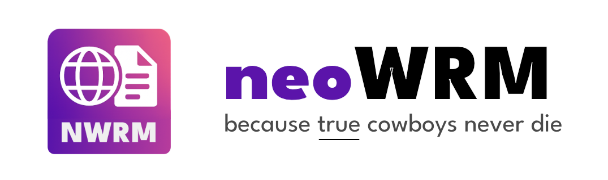
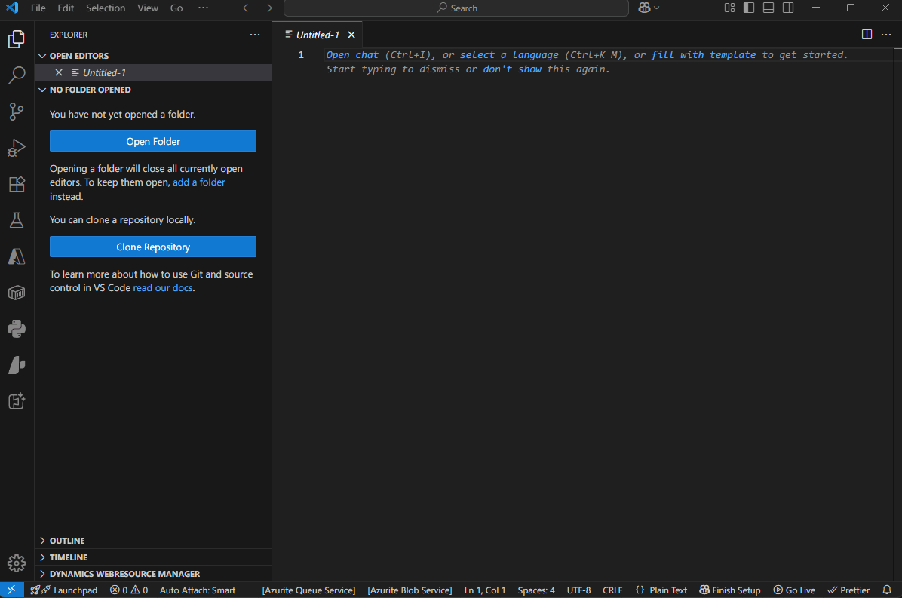
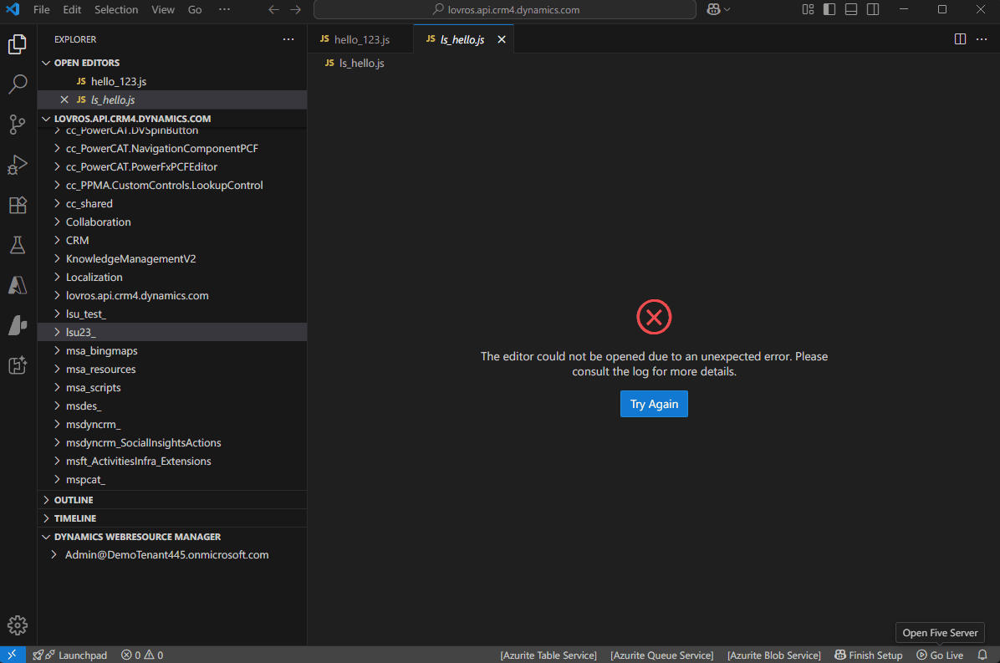

# Dynamics CRM Web Resources Manager VSCode Extension

This extension provides an integrated experience for managing Dynamics 365 (CRM) Web Resources directly from Visual Studio Code. It connects to your CRM instance, discovers all available environments and exposes Web Resources as virtual files in a writable virtual filesystem. You can open, edit, and save changes back to Dynamics without leaving VS Code.

## Now on [Visual Studio Marketplace](https://marketplace.visualstudio.com/items?itemName=LovroSuhadolnik.vscode-nwrm) 🎉
Just search for NWRM inside VSCode and install!


### ⚠️⚠️⚠️ IMPORTANT - There's a bug at the moment - the .env file is not created automatically
To resolve:
- Go to your home folder - for me, that's C:\Users\Lovro
- Then open .vscode folder and locate the extension - for me, that's in <br />
  `C:\Users\Lovro\.vscode\extensions\lovrosuhadolnik.vscode-nwrm-1.0.0`
- inside here, create a file called **.env** and paste the following line inside:

```txt
DYNAMICS_CRM_CLIENT_ID=21dd7d39-200f-4560-9a29-cf84629da135
```
- Save and reload your VSCode window

Will try to find some time to fix that soon :)


## Features

- **Interactive authentication** – Sign in to your Dynamics CRM tenant and automatically discover all environments using the Discovery Service. After signing in, you're prompted to choose the environment to connect to. A prompt copies the device code to your clipboard and opens the login page for you.
- **Virtual file system** – Browse and edit Web Resources using the built-in File Explorer.
- **Auto-publish on save** – Press `Ctrl+S` to upload and publish changes back to Dynamics CRM.
- **Publish command** – Publish individual Web Resources from the context menu or Command Palette.
- **Create, move, and rename** – Add new files and folders, move resources between folders, and rename them directly from VS Code. Renaming or moving automatically publishes the resource.
- **Folder rename** – Renaming a folder updates all contained Web Resources after confirmation.
- **Additional file types** – Supports images, XML, icons, and more alongside HTML, CSS, and JavaScript.
- **Explorer panel** – Manage saved accounts and environments from the new *Dynamics WebResource Manager* view under the File Explorer.
- **Command Palette command** – Quickly connect to an environment from the Command Palette.
- **Reload command** – Refresh the list of web resources on demand.
- **Type filter** – Limit loaded web resources by extension (JS, HTML, CSS, ...).
- **Lazy loading** – Web Resources are fetched the first time you open the folder.

## Demos

### Interactive login


### Editing files, moving between folders


## Getting Started

This repository contains a TypeScript-based VSCode extension compiled using the TypeScript compiler (`tsc`).

### Prerequisites

- [Node.js](https://nodejs.org/) 16 or later
- [pnpm](https://pnpm.io/) or `npm`
- [VS Code](https://code.visualstudio.com/)

### Setup

1. Install dependencies:
   ```bash
   npm install
   ```
2. Build the extension:
   ```bash
   npm run build
   ```
3. Extension icons are stored in the `images/` folder. The activity bar icon uses a 20x20 SVG (`images/webresource.svg`). Replace it with your own if desired.
4. Copy `.env.example` to `.env` and set `DYNAMICS_CRM_CLIENT_ID` to your Azure AD client ID.
5. Launch the extension in the Extension Development Host:
   ```bash
   code .
   ```
   Press `F5` in VS Code to start debugging.
   Once VS Code launches, run the **Dynamics CRM: Connect** command to sign in.
   A quick pick displays the device code and copies it to your clipboard,
   opening the login page when you press **Enter**. After signing in, select an
   environment from the **Dynamics WebResource Manager** view in the Explorer.
    If anything goes wrong during sign in or environment discovery, check the
    **Dynamics CRM** output channel for details.
    You can open the output view with `Ctrl+Shift+U` (View → Output) and choose
    **Dynamics CRM** from the channel dropdown to see detailed logs, including web
    resource load errors. Each HTTP request is logged with headers to make
    troubleshooting authentication problems easier.
    Saved connections with valid tokens appear in the **Dynamics WebResource Manager** panel so you can quickly reconnect or remove them.
    After selecting an environment, the extension acquires a separate access token scoped to that instance to avoid 401 errors caused by an invalid audience.
    Selecting an environment opens a virtual folder using the `d365-nwrm:` scheme
    (for example `d365-nwrm:/org.crm.dynamics.com`) where the Web Resources are
    shown. If prompted to trust the folder, choose **Yes**. Web Resources are
    loaded the first time you expand the folder.

### Environment Discovery

The extension retrieves available environments using the [Global Discovery Service](https://learn.microsoft.com/en-us/power-apps/developer/data-platform/discovery-service).
It issues the following request to list instances:

```http
GET https://globaldisco.crm.dynamics.com/api/discovery/v2.0/Instances?$select=ApiUrl,FriendlyName,UniqueName,UrlName,Url HTTP/1.1
Authorization: Bearer <access token>
```

The response contains environment metadata used to populate the Explorer view.

### Azure App Registration

1. Sign in to the [Azure Portal](https://portal.azure.com/) and open **Azure Active Directory** > **App registrations**.
2. Create a **New registration** and choose the **Public client/native** platform.
3. Add `http://localhost` as a redirect URI.
4. In the **Authentication** tab, enable **Allow public client flows** to permit device code login.
5. Under **API permissions** add the **Dynamics CRM** delegated permission `user_impersonation` and grant admin consent if required.
6. Copy the **Application (client) ID** and set `DYNAMICS_CRM_CLIENT_ID` in your `.env` file.

The extension authenticates using the device code flow and does not require a client secret.

### Scripts

- `npm run build` – Compile the extension using TypeScript.
- `npm test` – Currently runs the build as a sanity check.
- `npm run watch` – Rebuild on file changes.

## Installing from Releases

Download the `.vsix` file attached to the latest release on GitHub. In VS Code open the Command Palette with `Ctrl+Shift+P`, select **Extensions: Install from VSIX...**, and choose the downloaded file.

Alternatively install from the command line:

```bash
code --install-extension path/to/dynamics-crm-webresources.vsix
```

## License

This project is licensed under the MIT License. See [LICENSE](LICENSE) for details.
